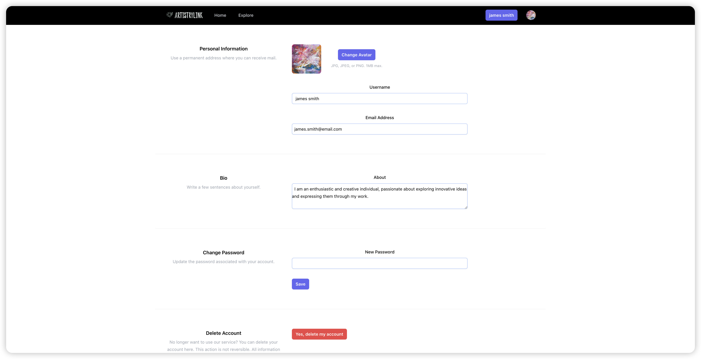
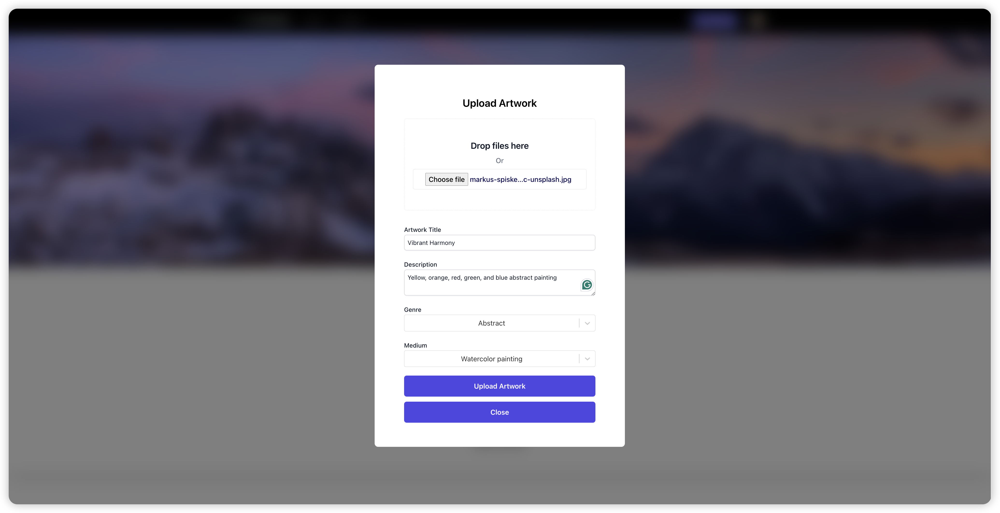
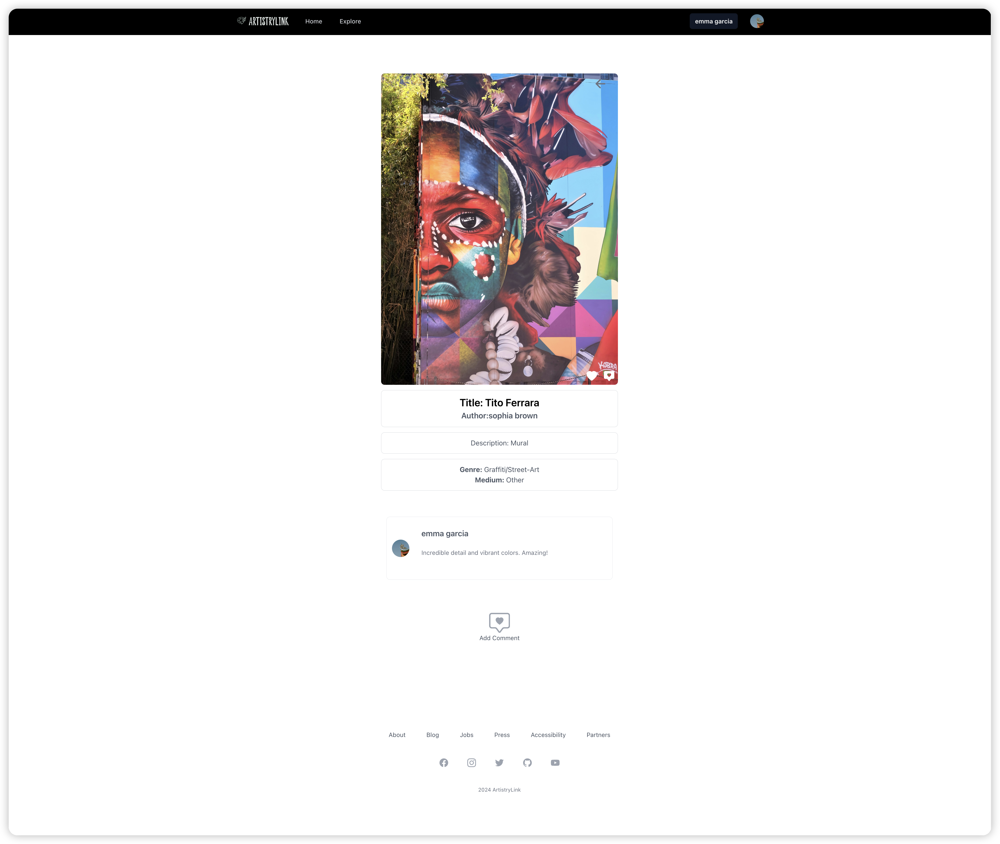

## ArtsitryLink

An online platform that enables artists to interact with art enthusiasts。

An Online art gallery where artists and art enthusiasts can gather to show off their work, gain some attention towards it, and share their opinions with other like-minded people.
Developed using the MERN stack, enhanced with Redux for state management, and styled using Tailwind css.

Developed using MERN stack, integrated with Stripe for secure payment processing. Styling with Tailwind css.

Deployed Link: [ArtistryLink](https://artistrylink.netlify.app/)

